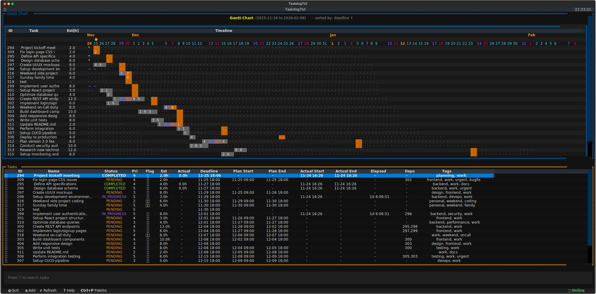
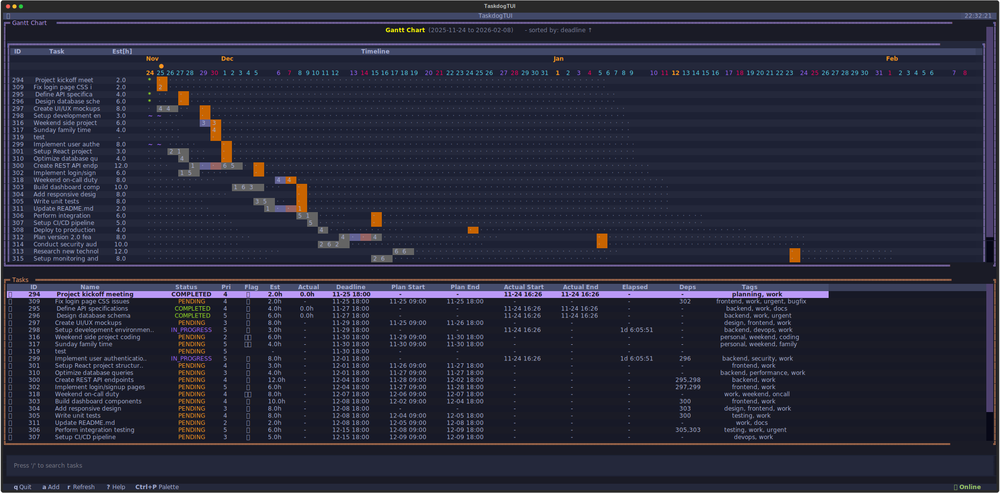
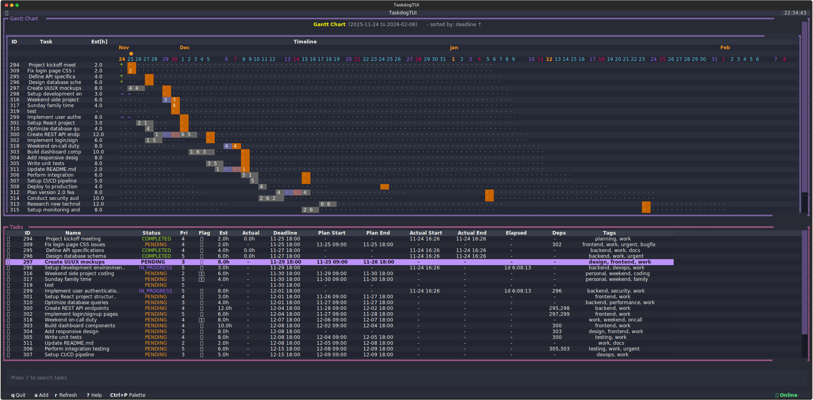
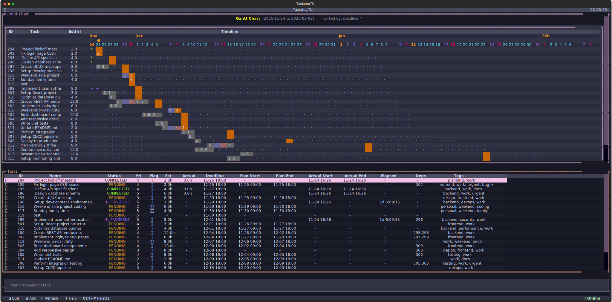
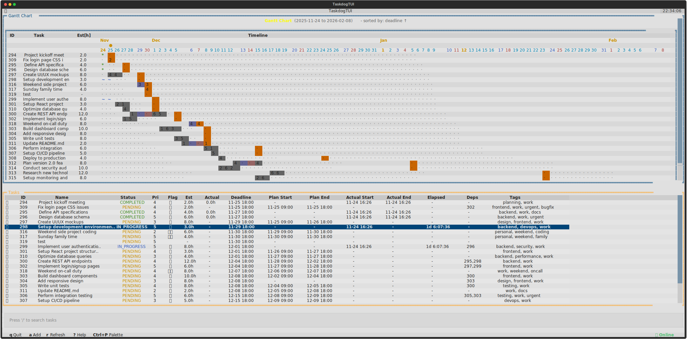

# Taskdog

[](https://github.com/Kohei-Wada/taskdog/actions/workflows/ci.yml)
[](https://opensource.org/licenses/MIT)
[](https://www.python.org/downloads/)
[](https://github.com/astral-sh/ruff)

A task management system with CLI/TUI interfaces and REST API server, featuring time tracking, schedule optimization, and beautiful terminal output.

**Note**: Designed for individual use. Stores tasks locally in SQLite database.



**Architecture**: UV workspace monorepo with three packages:

- **taskdog-core**: Core business logic and SQLite persistence
- **taskdog-server**: FastAPI REST API server
- **taskdog-ui**: CLI and TUI interfaces

## Table of Contents

- [Features](#features)
- [Design Philosophy](#design-philosophy)
- [Installation](#installation)
- [Quick Start](#quick-start)
- [Interactive TUI](#interactive-tui)
- [Themes](#themes)
- [API Server](#api-server)
- [Commands](#commands)
- [Configuration](#configuration)
- [Workflow](#workflow)
- [Development](#development)
- [Contributing](#contributing)

## Documentation

- **[Quick Start Guide](docs/QUICKSTART.md)** - Step-by-step setup in 5 minutes
- **[CLI Commands Reference](docs/COMMANDS.md)** - Complete command documentation
- **[API Reference](docs/API.md)** - REST API endpoints and examples
- **[Configuration Guide](docs/CONFIGURATION.md)** - All configuration options
- **[Development Guide](CLAUDE.md)** - Architecture and development workflow
- **[Contributing Guide](CONTRIBUTING.md)** - How to contribute
- **[Design Philosophy](docs/DESIGN_PHILOSOPHY.md)** - Why Taskdog works this way

## Features

- **REST API Server**: FastAPI-based server with automatic OpenAPI documentation
- **Multiple Interfaces**: CLI commands, full-screen TUI, and HTTP API
- **Schedule Optimization**: 9 algorithms to auto-generate optimal schedules (respects fixed tasks & dependencies)
- **Fixed Tasks**: Mark tasks as fixed to prevent rescheduling (e.g., meetings)
- **Task Dependencies**: Define dependencies with circular detection
- **Interactive TUI**: Full-screen interface with keyboard shortcuts
- **Time Tracking**: Automatic tracking with planned vs actual comparison
- **Gantt Chart**: Visual timeline with workload analysis
- **Markdown Notes**: Editor integration with Rich rendering
- **Batch Operations**: Start/complete/pause/cancel multiple tasks at once
- **Soft Delete**: Restore removed tasks
- **SQLite Storage**: Transactional persistence with ACID guarantees

## Design Philosophy

Taskdog is designed for **individual task management**, following GTD (Getting Things Done) principles:

- **Flat task structure** with dependencies (no parent-child hierarchy)
- **Focus on next actions** rather than complex project structures
- **Tags for grouping**, dependencies for ordering, notes for details
- **Transparent algorithms** - choose from 9 scheduling strategies you can understand
- **Privacy-first** - all data stored locally, no cloud requirements

**Why no subtasks?**
Individual users don't need complex hierarchies. Dependencies + tags cover 99% of personal task organization. This keeps the optimizer simple and your workflow focused.

For detailed design rationale, see [DESIGN_PHILOSOPHY.md](docs/DESIGN_PHILOSOPHY.md).

## Installation

**Requirements**: Python 3.11+ (3.13+ for individual packages), [uv](https://github.com/astral-sh/uv)

**Supported Platforms**: Linux, macOS (Windows support coming soon)

```bash
# Clone the repository
git clone https://github.com/Kohei-Wada/taskdog.git
cd taskdog

# Install globally (recommended - installs taskdog and taskdog-server commands)
make install

# OR: Install with development dependencies (for contributing)
make install-dev

# OR: Install locally for development (editable mode)
make install-local
```

**What gets installed:**

- `taskdog` - CLI and TUI interface
- `taskdog-server` - FastAPI REST API server
- **Linux**: systemd user service for automatic startup
- **macOS**: launchd service for automatic startup

**Platform-Specific Service Management:**

**Linux (systemd):**

```bash
systemctl --user start taskdog-server    # Start server
systemctl --user status taskdog-server   # Check status
systemctl --user stop taskdog-server     # Stop server
journalctl --user -u taskdog-server -f   # View logs
```

**macOS (launchd):**

```bash
launchctl start com.github.kohei-wada.taskdog-server   # Start server
launchctl stop com.github.kohei-wada.taskdog-server    # Stop server
launchctl list | grep taskdog-server                   # Check status
tail -f ~/Library/Logs/taskdog-server.log              # View logs
```

**Common Make targets:**

```bash
make install          # Install as global commands via uv tool
make check-deps       # Check if required tools are installed
make install-dev      # Install all packages with dev dependencies
make install-local    # Install locally for development (per-package)
make reinstall        # Clean and reinstall
make uninstall        # Remove global installations
```

## Quick Start

```bash
# Install
make install

# Start server (required)
taskdog-server

# Try it
taskdog add "My first task" --priority 10
taskdog table
taskdog tui
```

For detailed setup and troubleshooting, see **[Quick Start Guide](docs/QUICKSTART.md)**.

## Interactive TUI

Taskdog includes a full-screen terminal user interface (TUI) for managing tasks interactively.

**Features:**

- Real-time task search and filtering
- Keyboard shortcuts for quick operations
- Sort by deadline, priority, planned start, or ID
- Visual status indicators with colors
- Task details panel with dependencies

**Keyboard Shortcuts:**

- `a` - Add new task
- `s` - Start selected task
- `P` - Pause selected task
- `d` - Complete (done) selected task
- `c` - Cancel selected task
- `R` - Reopen task
- `x` - Archive task (soft delete)
- `X` - Hard delete task (permanent)
- `i` - Show task details
- `e` - Edit task
- `v` - Edit task note
- `t` - Toggle visibility of completed/canceled tasks
- `r` - Refresh task list
- `Ctrl+T` - Toggle sort order (ascending/descending)
- `/` - Focus search box
- `Escape` - Clear/hide search
- `Ctrl+P` or `Ctrl+\` - Command palette (for optimize and other commands)
- `q` - Quit

Launch the TUI with:

```bash
taskdog tui
```

## Themes

Taskdog supports multiple beautiful themes out of the box. Configure your preferred theme in `~/.config/taskdog/cli.toml`:

```toml
[ui]
theme = "tokyo-night"  # Options: textual-dark, textual-light, tokyo-night, dracula, catppuccin-mocha
```

<table>
  <tr>
    <td align="center">
      <b>Tokyo Night</b><br/>
      
    </td>
    <td align="center">
      <b>Dracula</b><br/>
      
    </td>
  </tr>
  <tr>
    <td align="center">
      <b>Catppuccin Mocha</b><br/>
      
    </td>
    <td align="center">
      <b>Textual Light</b><br/>
      
    </td>
  </tr>
</table>

**Default theme**: `textual-dark` (shown at the top of this README)

## API Server

The FastAPI server provides a comprehensive REST API for all task management operations.

### Starting the Server

```bash
taskdog-server                           # Default: http://127.0.0.1:8000
taskdog-server --host 0.0.0.0            # Bind to all interfaces
taskdog-server --port 3000               # Custom port
taskdog-server --reload                  # Auto-reload for development
taskdog-server --workers 4               # Production with multiple workers
```

**Quick API Examples:**

```bash
# Create task
curl -X POST http://localhost:8000/api/v1/tasks/ \
  -H "Content-Type: application/json" \
  -d '{"name": "API Task", "priority": 100}'

# List tasks
curl http://localhost:8000/api/v1/tasks/

# Start task
curl -X POST http://localhost:8000/api/v1/tasks/1/start
```

**See [API Reference](docs/API.md) for complete endpoint documentation.**

## Commands

**Common Commands:**

```bash
# Task management
taskdog add "Task name" -p 150           # Create task with priority
taskdog start 1                          # Start task
taskdog done 1                           # Complete task
taskdog rm 1                             # Archive task (soft delete)

# Dependencies & Tags
taskdog add-dependency 2 1               # Task 2 depends on task 1
taskdog tags 1 backend api               # Set tags

# Visualization
taskdog table                            # Table view
taskdog gantt                            # Gantt chart
taskdog today                            # Today's tasks
taskdog tui                              # Interactive TUI

# Optimization
taskdog optimize                         # Auto-schedule tasks
taskdog optimize -a balanced             # Use balanced algorithm
```

**See [CLI Commands Reference](docs/COMMANDS.md) for complete command documentation.**

## Configuration

**Config file**: `~/.config/taskdog/cli.toml`

**Minimal configuration** (only needed if using non-default host/port):

```toml
[api]
host = "127.0.0.1"
port = 8000
```

**With theme and optimization:**

```toml
[api]
host = "127.0.0.1"
port = 8000

[ui]
theme = "tokyo-night"

[optimization]
max_hours_per_day = 8.0
default_algorithm = "balanced"
```

**See [Configuration Guide](docs/CONFIGURATION.md) for all available options.**

## Workflow

1. **Create tasks** with priorities and estimates
2. **Set deadlines** and dependencies
3. **Run optimizer** to auto-generate schedules
4. **Track progress** with start/done commands
5. **Review** with `today` and `gantt` commands

## Development

**Requirements**: Python 3.11+, [uv](https://github.com/astral-sh/uv)

**Quick start:**

```bash
# Setup
make install-dev                    # Install with dev dependencies

# Testing
make test                           # Run all tests with coverage

# Code Quality
make lint                           # Lint code
make format                         # Format code
make check                          # Lint + typecheck
```

**Architecture**: UV workspace monorepo with Clean Architecture principles.

- **taskdog-core**: Domain, Application, Infrastructure layers
- **taskdog-server**: FastAPI REST API (Presentation layer)
- **taskdog-ui**: CLI/TUI interfaces (Presentation layer)

**See [CLAUDE.md](CLAUDE.md) for detailed development guide and architecture documentation.**

## Contributing

Contributions are welcome! Please see [CONTRIBUTING.md](CONTRIBUTING.md) for detailed guidelines on:

- Development setup and workflow
- Coding standards and testing
- Commit guidelines and PR process
- Project structure and architecture

**CI/CD**: All pull requests automatically run:

- Linting (`make lint`)
- Type checking (`make typecheck`)
- Tests with coverage (`make test`)

Coverage reports are displayed in CI logs, sorted by coverage (low → high) to highlight areas needing improvement.

## License

This project is licensed under the MIT License - see the [LICENSE](LICENSE) file for details.
