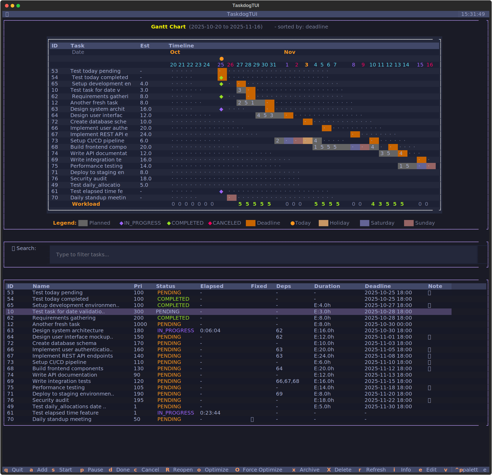

# Taskdog

A personal task management CLI tool with time tracking, schedule optimization, and beautiful terminal output.

**Note**: Designed for individual use. Stores tasks locally.

## Features

- **Schedule Optimization**: 9 algorithms to auto-generate optimal schedules (respects fixed tasks & dependencies)
- **Fixed Tasks**: Mark tasks as fixed to prevent rescheduling (e.g., meetings)
- **Task Dependencies**: Define dependencies with circular detection
- **Interactive TUI**: Full-screen interface with keyboard shortcuts
- **Time Tracking**: Automatic tracking with planned vs actual comparison
- **Gantt Chart**: Visual timeline with workload analysis
- **Markdown Notes**: Editor integration with Rich rendering
- **Batch Operations**: Start/complete/pause/cancel multiple tasks at once
- **Soft Delete**: Restore removed tasks

## Installation

```bash
# Clone the repository
git clone https://github.com/Kohei-Wada/taskdog.git
cd taskdog

# Install using Make
make install
```

## Quick Start

```bash
# Add tasks with priorities and estimates
taskdog add "Design phase" -p 150
taskdog add "Implementation" -p 100
taskdog deadline 1 2025-10-20
taskdog est 1 16

# Add fixed task (won't be rescheduled)
taskdog add "Team meeting" --fixed
taskdog schedule 2 "2025-10-22 10:00" "2025-10-22 11:00"

# Add dependencies and optimize
taskdog add-dependency 2 1          # Task 2 depends on task 1
taskdog optimize                    # Auto-generate schedule

# Manage tasks
taskdog start 1                     # Start task
taskdog done 1                      # Complete task
taskdog start 2 3 4                 # Batch operations
taskdog note 1                      # Edit notes

# Visualize
taskdog table                       # Table view
taskdog gantt                       # Gantt chart
taskdog today                       # Today's tasks
taskdog tui                         # Interactive TUI
```

## Interactive TUI

Taskdog includes a full-screen terminal user interface (TUI) for managing tasks interactively.



**Features:**
- Real-time task search and filtering
- Keyboard shortcuts for quick operations
- Sort by deadline, priority, planned start, or ID
- Visual status indicators with colors
- Task details panel with dependencies

**Keyboard Shortcuts:**
- `a` - Add new task
- `s` - Start selected task
- `P` - Pause selected task
- `d` - Complete (done) selected task
- `c` - Cancel selected task
- `R` - Reopen task
- `x` - Archive task (soft delete)
- `X` - Hard delete task (permanent)
- `i` - Show task details
- `e` - Edit task
- `v` - Edit task note
- `t` - Toggle visibility of completed/canceled tasks
- `o` - Run optimizer
- `r` - Refresh task list
- `S` - Sort selection dialog (deadline/planned_start/priority/estimated_duration/id)
- `/` - Focus search box
- `Escape` - Clear/hide search
- `q` - Quit

Launch the TUI with:
```bash
taskdog tui
```

## Commands

### Core Commands

**Task Creation & Updates**
- `add "Task name" [-p PRIORITY] [--fixed] [-d DEP_ID] [-t TAG]` - Create task (multiple -d and -t allowed)
- `deadline ID DATE` - Set deadline (YYYY-MM-DD or YYYY-MM-DD HH:MM:SS)
- `priority ID N` - Set priority (higher = more important)
- `est ID HOURS` - Set estimated duration
- `schedule ID START [END]` - Set planned schedule
- `rename ID NAME` - Rename task
- `update ID [--name] [--priority] [--status] [--planned-start] [--planned-end] [--deadline] [--estimated-duration]` - Multi-field update

**Task Management**
- `start ID...` - Start tasks (records actual start time)
- `done ID...` - Complete tasks (records actual end time)
- `pause ID...` - Pause tasks (reset to PENDING)
- `cancel ID...` - Cancel tasks
- `reopen ID...` - Reopen completed/canceled tasks
- `rm ID... [--hard]` - Remove tasks (soft delete by default)
- `restore ID...` - Restore soft-deleted tasks

**Dependencies**
- `add-dependency TASK_ID DEP_ID` - Add dependency (circular detection)
- `remove-dependency TASK_ID DEP_ID` - Remove dependency

**Tags Management**
- `tags` - List all tags with counts
- `tags ID` - Show tags for a task
- `tags ID TAG1 TAG2...` - Set tags for a task (replaces existing)

**Time Tracking**
- `log-hours ID HOURS [-d DATE]` - Log actual hours worked (default: today)

**Optimization**
- `optimize [--start-date DATE] [--max-hours-per-day N] [-a ALGORITHM] [-f]`
  - Algorithms: greedy (default), balanced, backward, priority_first, earliest_deadline, round_robin, dependency_aware, genetic, monte_carlo
  - Respects fixed tasks and dependencies
  - Distributes workload across weekdays

**Visualization**
- `table` - Table view with extensive options:
  - Sort: `-s/--sort` (id, priority, deadline, name, status, planned_start)
  - Filter: `--status` (pending, in_progress, completed, canceled, archived), `-t/--tag`, `--start-date`, `--end-date`
  - Display: `-a/--all` (include archived), `-r/--reverse`, `-f/--fields` (custom field selection)
- `gantt` - Gantt chart with workload analysis:
  - Same filter/sort options as table (default sort: deadline)
- `today` - Today's tasks (deadline today, planned includes today, or IN_PROGRESS)
- `week` - This week's tasks (same filtering logic as today)
- `show ID [--raw]` - Task details + notes (markdown rendered or raw)
- `export` - Export tasks:
  - Format: `--format` (json [default] or csv)
  - Output: `-o/--output FILE`
  - Fields: `-f/--fields` (custom field selection)
  - Filters: Same as table (--all, --status, --tag, --start-date, --end-date)

**Analytics**
- `stats` - Task statistics and analytics:
  - Period: `-p/--period` (all [default], 7d, 30d)
  - Focus: `-f/--focus` (all [default], basic, time, estimation, deadline, priority, trends)

**Notes & TUI**
- `note ID` - Edit markdown notes ($EDITOR)
- `tui` - Interactive TUI
  - See Interactive TUI section above for full keyboard shortcuts
  - Search: `/` to search, `Escape` to clear
  - Sort: `S` for sort dialog (deadline/planned_start/priority/estimated_duration/id)


## Task States

- **PENDING**: Not started (yellow)
- **IN_PROGRESS**: Being worked on (blue)
- **COMPLETED**: Finished (green)
- **CANCELED**: Won't be done (red)
- **ARCHIVED**: Soft-deleted (can be restored)

## Tags

Tasks can be organized with tags for better categorization and filtering.

```bash
# Add task with tags
taskdog add "Backend API" --tag backend --tag api

# Manage tags
taskdog tags                    # List all tags with counts
taskdog tags 1                  # Show tags for task 1
taskdog tags 1 urgent backend   # Set tags (replaces existing)

# Filter by tags
taskdog table --tag backend     # Show tasks with 'backend' tag
taskdog table --tag api --tag db  # OR logic: tasks with 'api' OR 'db'
```

## Data Storage

**Tasks**: `$XDG_DATA_HOME/taskdog/tasks.json` (fallback: `~/.local/share/taskdog/tasks.json`)

**Config**: `$XDG_CONFIG_HOME/taskdog/config.toml` (fallback: `~/.config/taskdog/config.toml`)

### Configuration

Optional TOML configuration file with the following sections:

```toml
[optimization]
max_hours_per_day = 6.0        # Default work hours per day (default: 6.0)
default_algorithm = "greedy"   # Default scheduling algorithm (default: "greedy")

[task]
default_priority = 5           # Default task priority (default: 5)

[display]
datetime_format = "%Y-%m-%d %H:%M:%S"  # Datetime display format

[time]
default_start_hour = 9         # Business day start hour (default: 9)
default_end_hour = 18          # Business day end hour (default: 18)

[region]
country = "JP"                 # ISO 3166-1 alpha-2 country code for holiday checking
                               # Examples: "JP", "US", "GB", "DE"
                               # Default: None (no holiday checking)
```

**Priority**: CLI arguments > Config file > Defaults

## Workflow

1. **Create tasks** with priorities and estimates
2. **Set deadlines** and dependencies
3. **Run optimizer** to auto-generate schedules
4. **Track progress** with start/done commands
5. **Review** with `today` and `gantt` commands

## Development

**Requirements**: Python 3.13+, [uv](https://github.com/astral-sh/uv)

```bash
# Install
make install

# Test
make test                           # All tests
PYTHONPATH=src uv run python -m unittest tests/test_module.py  # Single file

# Run during development
PYTHONPATH=src uv run python -m taskdog.cli --help
```

### Architecture

**Clean Architecture** with 5 layers:
- **Domain**: Entities (Task), services (TimeTracker), exceptions
- **Application**: Use cases, queries, DTOs, validators, optimization strategies
- **Infrastructure**: Repository implementations (JSON persistence)
- **Presentation**: CLI commands, renderers, TUI
- **Shared**: Cross-cutting utilities (XDG paths, config manager)

**Key Patterns**: Use Case, Repository, Dependency Injection, CQRS-like, Template Method, Strategy, Command

See [CLAUDE.md](CLAUDE.md) for details.

## Contributing

Contributions are welcome! Please feel free to submit a Pull Request.

## License

This project is open source and available under the MIT License.
