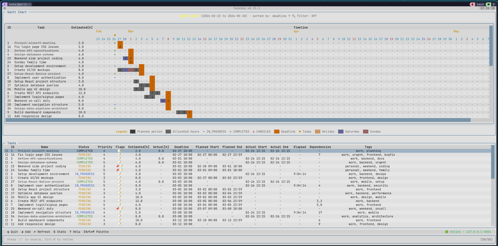
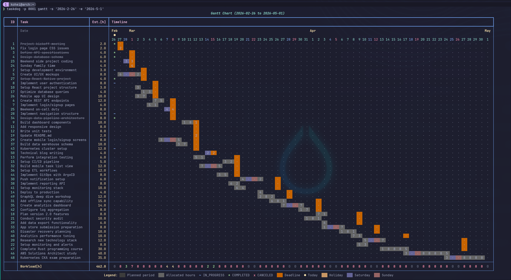

<h1 align="center">Taskdog</h1>

<p align="center">
  <a href="https://github.com/Kohei-Wada/taskdog/actions/workflows/ci.yml"></a>
  <a href="https://pypi.org/project/taskdog-ui/"></a>
  <a href="https://opensource.org/licenses/MIT"></a>
  <a href="https://www.python.org/downloads/"></a>
</p>

<p align="center">
  A task management system with CLI/TUI interfaces and REST API server, featuring time tracking, schedule optimization, and beautiful terminal output.<br>
  Designed for individual use. Stores tasks locally in SQLite database.
</p>

https://github.com/user-attachments/assets/2c0de3ec-fa3d-4f41-ae01-acbff04931e3

<details>
<summary>Screenshots</summary>

**TUI (Textual)**



**Gantt Chart (CLI)**



</details>

## Try It Out

Try taskdog with ~50 sample tasks. No installation required — just Docker:

```bash
docker run --rm -it ghcr.io/kohei-wada/taskdog:demo
```

The TUI works inside the container, but some keybindings (e.g., `Ctrl+P` for command palette) may conflict with Docker's key sequences. For the best experience, run the server in a container and connect from your host:

```bash
docker run --rm -d -p 8000:8000 --name taskdog-demo ghcr.io/kohei-wada/taskdog:demo

# Wait for the server and demo data to be ready (~15s)
docker logs -f taskdog-demo 2>&1 | grep -m1 "Server ready"

uvx --from taskdog-ui taskdog tui
```

> `uvx` comes with [uv](https://github.com/astral-sh/uv). It runs the command in a temporary environment without installing anything.

## Installation

**Requirements**: Python 3.12+, [uv](https://github.com/astral-sh/uv)

**Supported Platforms**: Linux, macOS

**Experimental**: Windows (WSL2 recommended; native support is still being hardened)

### Recommended (with systemd/launchd service)

```bash
git clone https://github.com/Kohei-Wada/taskdog.git
cd taskdog
make install
```

This installs the CLI/TUI and server, and sets up a systemd (Linux) or launchd (macOS) service so the server starts automatically.

### Arch Linux (AUR)

```bash
yay -S taskdog
```

Installs the CLI/TUI, server, and MCP binaries plus the systemd **user** service
(enable per-user with `systemctl --user enable --now taskdog-server`). See
[`contrib/aur/`](contrib/aur/) for packaging details.

### From PyPI

```bash
pip install taskdog-ui[server]
```

You'll need to manage the server process yourself (e.g., `taskdog-server &`).

### Windows users

- WSL2 is recommended and follows the same setup flow as Linux.
- Native Windows support is experimental. By default, data is stored under
  `%LOCALAPPDATA%\taskdog` and configuration under `%APPDATA%\taskdog`.
- The editor integration checks `%EDITOR%` first, then falls back to `code`,
  `notepad`, and `vim`.

## Usage

```bash
taskdog add "My first task" --priority 10
taskdog list
taskdog gantt
taskdog tui
```

For complete setup including API key configuration, see **[Quick Start Guide](docs/QUICKSTART.md)**.

## Features

- **Multiple Interfaces**: CLI, full-screen TUI, and REST API
- **Schedule Optimization**: 9 algorithms (greedy, genetic, monte carlo, etc.)
- **Search & Filter**: fzf-style queries, progressive filter chains, multi-field sort
- **Time Tracking**: Automatic tracking with planned vs actual comparison
- **Gantt Chart**: Visual timeline with workload analysis
- **Task Dependencies**: With circular dependency detection
- **Markdown Notes**: Editor integration with Rich rendering
- **Audit Logging**: Track all task operations
- **MCP Integration**: Claude Desktop support via Model Context Protocol

### Search, filter & sort

Maximize the task list, sort it from the command palette, then narrow it down with `/` search, `Ctrl+U` to re-search, and `Ctrl+R` to build a progressive filter chain (substring + status/tag exclusion):

https://github.com/user-attachments/assets/dcb44390-7b10-49a0-bdfc-01a03d7751f9

## Documentation

- **[Quick Start Guide](docs/QUICKSTART.md)** - Step-by-step setup
- **[CLI Commands Reference](docs/COMMANDS.md)** - Complete command documentation
- **[API Reference](docs/API.md)** - REST API endpoints and examples
- **[Configuration Guide](docs/CONFIGURATION.md)** - All configuration options
- **[Design Philosophy](docs/DESIGN_PHILOSOPHY.md)** - Why Taskdog works this way
- **[Deployment Guide](contrib/README.md)** - Docker, systemd, launchd

## Architecture

UV workspace monorepo with five packages:

| Package | Description | PyPI |
| ------- | ----------- | ---- |
| [taskdog-core](packages/taskdog-core) | Core business logic and SQLite persistence | [](https://pypi.org/project/taskdog-core/) |
| [taskdog-client](packages/taskdog-client) | HTTP API client library | [](https://pypi.org/project/taskdog-client/) |
| [taskdog-server](packages/taskdog-server) | FastAPI REST API server | [](https://pypi.org/project/taskdog-server/) |
| [taskdog-ui](packages/taskdog-ui) | CLI and TUI interfaces | [](https://pypi.org/project/taskdog-ui/) |
| [taskdog-mcp](packages/taskdog-mcp) | MCP server for Claude Desktop | [](https://pypi.org/project/taskdog-mcp/) |

## Contributing

Contributions are welcome! See [CONTRIBUTING.md](CONTRIBUTING.md) for guidelines.

## License

MIT License - see [LICENSE](LICENSE) for details.
